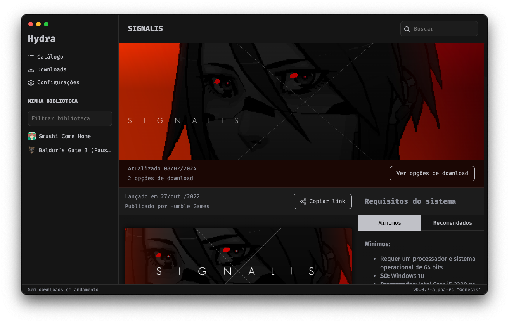

  <h1 align="center">Hydra Launcher</h1>

  

    <strong>Fork of <a href="https://github.com/hydralauncher/hydra">hydralauncher/hydra</a> with self-hosted API support, dual accounts, and cloud save improvements.</strong>
  

## Fork additions

- **Self-hosted API** — run your own backend for cloud saves, achievements and accounts: [entitybtw/hydra-selfhosted](https://github.com/entitybtw/hydra-selfhosted)
- **Dual accounts** — use both official Hydra account and self-hosted simultaneously; sidebar shows both profiles
- **Cloud save restore improvements** — diff-based restore deletes stale save files not present in backup (prevents old levels/slots persisting after restore)
- **Official profile editing** — Edit Profile on the official account tab edits the official account, not the self-hosted one

## Features

- Add games that you own to your library
- Have a nice profile that shows what you are playing to your friends
- Save your game progress in the cloud with Hydra Cloud
- Unlock achievements
- Navigate through a rich catalogue with a powerful suggestion algorithm
- Discover new games that you haven't played before

## Build from source and contributing

Please, refer to our Documentation pages: [docs.hydralauncher.gg](https://docs.hydralauncher.gg/getting-started)

### Local development requirements

- Node.js + Yarn
- Python 3.9+ with `pip install -r requirements.txt`
- Rust toolchain (for `hydra-native`)

After installing dependencies, `postinstall` now builds the Rust native addon automatically (`hydra-native/hydra-native.node`).

Packaging scripts (`yarn build:win`, `yarn build:mac`, `yarn build:linux`, `yarn build:unpack`) now run `yarn build:python-rpc` automatically.

## Contributors

## License

Hydra is licensed under the [MIT License](LICENSE).
