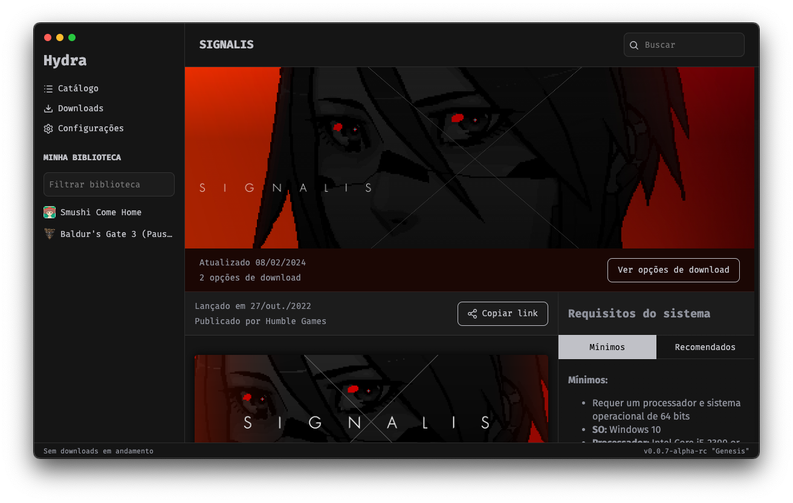

  <h1 align="center">Hydra Launcher</h1>

  

    <strong>Hydra Launcher is an open-source gaming platform created to be the single tool that you need in order to manage your gaming library. Hydra is written in Node.js (Electron, React, Typescript) and Rust, with libtorrent providing the torrent engine.</strong>
  

## Features

- Add games that you own to your library
- Have a nice profile that shows what you are playing to your friends
- Save your game progress in the cloud with Hydra Cloud
- Unlock achievements
- Navigate through a rich catalogue with a powerful suggestion algorithm
- Discover new games that you haven't played before

## Build from source and contributing

Please, refer to our Documentation pages: [docs.hydralauncher.gg](https://docs.hydralauncher.gg/getting-started)

### Local development requirements

- Node.js + Yarn
- Rust toolchain (for `hydra-native`)
- Git and a C++ toolchain (Visual Studio C++ Build Tools on Windows, GCC/Clang on Linux, Xcode command-line tools on macOS). The native build obtains CMake and CTest automatically through vcpkg.

After installing dependencies, `postinstall` now builds the Rust native addon automatically (`hydra-native/hydra-native.node`).

The native build includes a Rust wrapper around pinned libtorrent. Development and packaged torrenting no longer require Python.

On Windows x64 and Linux x64, the libtorrent bridge comes prebuilt from `native/torrent-bridge/prebuilt`, so installs skip compiling libtorrent through vcpkg. Other platforms build it from source. When a branch push changes `native/torrent-bridge` or `scripts/build-torrent-bridge.cjs`, the "Torrent bridge prebuilts" workflow rebuilds the binaries and commits them to that branch; until then, installs build the bridge from source. Set `HYDRA_TORRENT_BRIDGE_FROM_SOURCE=1` to always build it from source.

## Contributors

## License

Hydra is licensed under the [MIT License](LICENSE).
