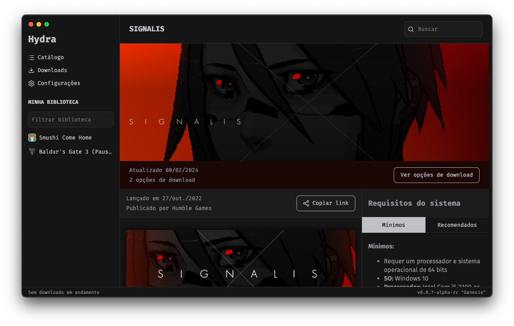

<br>

<div align="center">

[](https://hydralauncher.site)

  <h1 align="center">Hydra Launcher</h1>

  <p align="center">
    <strong>Hydra er en spil launcher med sin egen indbyggede bittorrent klient.</strong>
  </p>

[](https://github.com/hydralauncher/hydra/actions)
[](https://github.com/hydralauncher/hydra/releases)

[](README.pt-BR.md)
[](README.md)
[](README.ru.md)
[](README.uk-UA.md)
[](README.be.md)
[](README.es.md)
[](README.fr.md)
[](README.de.md)
[](README.it.md)
[](README.cs.md)
[](README.da.md)



</div>

## Indholdsfortegnelse

- [Indholdsfortegnelse](#indholdsfortegnelse)
- [Om](#om)
- [Funktioner](#funktioner)
- [Installation](#installation)
- [Bidrag](#-bidrag)
  - [Bliv medlem af vores Telegram kanal](#-join-our-telegram)
  - [Fork og klon dit repo](#fork-and-clone-your-repository)
  - [Måder du kan bidrage](#ways-you-can-contribute)
  - [Projekt Struktur](#project-structure)
- [Byg fra kildekode](#build-from-source)
  - [Installér Node.js](#install-nodejs)
  - [Installér Yarn](#install-yarn)
  - [Installér Node Afhængigheder](#install-node-dependencies)
  - [Installér Python 3.9](#install-python-39)
  - [Installér Python Afhængigheder](#install-python-dependencies)
- [Miljøvariabler](#environment-variables)
- [Køre](#running)
- [Bygge](#build)
  - [Bygge bittorrent klienten](#build-the-bittorrent-client)
  - [Bygge Electron applikationen](#build-the-electron-application)
- [Bidragere](#contributors)
- [Licens](#license)

## Om

**Hydra** er en **Spil Launcher** med sin egen indbyggede **BitTorrent Klient**.
<br>
Launcheren er skrevet i TypeScript (Electron) og Python, som håndterer torrenting system ved brug af libtorrent.

## Funktioner

- Sin egen indbyggede bittorrent klient
- How Long To Beat (HLTB) integration på spil siden
- Downloadsti tilpasning
- Windows og Linux understøttelse
- Konstant opdateret
- Og mere ...

## Installation

Følg trinene her under for at installere:

1. Download den seneste version af Hydra fra [Releases](https://github.com/hydralauncher/hydra/releases/latest) siden.
   - Download kun .exe hvis du vil installere Hydra på Windows.
   - Download .deb, .rpm eller .zip hvis du vil installere Hydra på Linux. (afhænger af din Linux distro)
2. Kør den downloadede fil.
3. Nyd Hydra!

## <a name="bidrag"> Bidrag

### <a name="join-our-telegram"></a> Bliv medlem af vores Telegram kanal

Vi holder vores diskusioner i vores [Telegram](https://t.me/hydralauncher) kanal.

### Fork og klon dit repo

1. Fork repoet [(klik her for at forke nu)](https://github.com/hydralauncher/hydra/fork)
2. Klon din forkede kode `git clone https://github.com/dit_brugernavn/hydra`
3. Lav en ny branch
4. Skub dine commits
5. Indsend en ny Pull Request

### Måder du kan bidrage

- Oversættelse: Vi vil gerne have at Hydra er tilgængeligt for så mange folk som overhovedet muligt. Du er velkommen til at hjælpe med at oversætte til nye sprog eller at opdatere og forbedre de sprog som allerede er tilgængelige i Hydra.
- Kode: Hydra er lavet med Typescript, Electron og en lille smule Python. Hvis du har lyst til at bidrage, kan du blive medlem af vores [Telegram](https://t.me/hydralauncher) kanal! (Alt kommunikation foregår hovedsageligt på Engelsk, Brasiliansk eller Russisk)

### Projekt struktur

- torrent-client: Vi bruger libtorrent, et Python bibliotek, til at administrere torrent downloads
- src/renderer: UI'en i applikationen
- src/main: her har vi al logikken

## Byg fra kildekode

### Installér Node.js

Vær sikker på at du har Node.js installeret på din maskine. Hvis ikke, kan du downloade og installere det fra [nodejs.org](https://nodejs.org/).

### Installér Yarn

Yarn er et pakkehåndteringsprogram til Node.js. Hvis du ikke har installeret Yarn endnu, så kan du gøre det ved at følge instruktionerne på [yarnpkg.com](https://classic.yarnpkg.com/lang/en/docs/install/).

### Installér Node Afhængigheder

Navigér til projekt mappen og installér Node afhængighederne ved bruge af Yarn:

```bash
cd hydra
yarn
```

### Installér Python 3.9

Vær sikker på at du har Python 3.9 installeret på din maskine. Du kan downloade og installere det her: [python.org](https://www.python.org/downloads/release/python-3913/).

### Installér Python Afhængigheder

Installér de påkrævede Python afhængigheder ved brug af pip:

```bash
pip install -r requirements.txt
```

## Miljøvariabler

Du får brug for en SteamGridDB API nøgle for at kunne hente spil ikonerne under installationen.

Når du har det, kan du kopiere og omdøbe `.env.example` filen til `.env` og indsætte nøglen som `STEAMGRIDDB_API_KEY`.

## Køre

Når alt er sat op, kan du køre den følgende kommando for at starte både Electron processen og bittorrent klienten:

```bash
yarn dev
```

## Bygge

### Byg bittorrent klienten

Byg bittorrent klienten ved brug af følgende kommando:

```bash
python torrent-client/setup.py build
```

### Byg Electron applikationen

Byg Electron applikationen ved brug af følgende kommando:

På Windows:

```bash
yarn build:win
```

På Linux:

```bash
yarn build:linux
```

## Bidragere

<a href="https://github.com/hydralauncher/hydra/graphs/contributors">
  
</a>

## Licens

Hydra benytter sig af [MIT Licensen](LICENSE).
